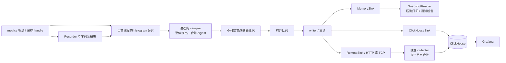

# metrics-exporter-summary 设计文档

本文描述七个 crate 的行为合同、当前实现选择和部署边界。性能与上线容量需在实际运行环境中验证，复现方法见[基准指南](docs/BENCHMARKS.md)。

项目及核心 Recorder 的 Cargo package 名称：`metrics-exporter-summary`，Rust 导入路径为 `metrics_exporter_summary`。项目采用 Cargo workspace，公共模型、存储后端、网络协议和 collector 服务分别发布为 crate，具体边界见第 3 节。

crate description：

> A metrics backend that exports compact statistical summaries to pluggable storage sinks.

名称使用 `metrics-exporter-*` 表达对 `metrics` 生态的接入，`summary` 表达本地聚合和紧凑摘要输出；不绑定具体的草图算法或存储后端。Counter 和 Gauge 同样属于支持范围。

## 1. 背景与目标

应用需要监控延迟等数值分布，主要关心每个节点、每组标签、每个统计窗口的 `count / mean / min / p50 / p90 / p95 / p99 / max`。上报完整直方图或分布草图会增加网络和存储开销，而多数面板与告警只使用这些统计量。

本项目使用 `metrics` crate 作为应用埋点接口，实现自定义 `Recorder`：在进程内按线程维护 t-digest，周期合并为节点摘要，再批量写入可配置的存储后端。分布草图和原始样本留在进程内。

跨节点与跨窗口允许使用“平均节点 p99”“最差节点 p99”等统计方式，不要求由已上报的摘要重建全局分布。

### 1.1 已确定的方向

- 创建独立 Rust 项目 `metrics-exporter-summary`，通过可插拔的存储后端输出摘要。
- 业务使用 `metrics` 的标准埋点接口。
- 分布统计采用线程级 t-digest，同进程内先合并草图，再提取分位数。
- 周期输出紧凑统计摘要，采集与存储写入分离。
- 提供三种后端形态：最近若干次快照的纯内存存储、直写 ClickHouse、经 HTTP/TCP 发往独立 collector 后合批写 ClickHouse。
- 多个后端共享同一摘要模型；独立 collector 复用 ClickHouse 写入实现。
- 远端 ACK 时机可配置：允许进入 collector 内存队列即确认，也可等待 ClickHouse 插入确认。
- 保留 `count`，支持按请求量加权计算平均值。
- 每个 Batch 必须携带非空 Source `hostname`，内存、协议保留该字段，ClickHouse 默认映射为 `host` 标签；默认读取 OS hostname，也允许应用显式配置物理宿主机名称。
- 接受跨节点、跨时间的分位数聚合只有面板定义的近似含义。

### 1.2 当前首版选择

| 项目 | 首版选择 |
| --- | --- |
| 分布输出 | `count / sum / min / p50 / p90 / p95 / p99 / max`；写入 ClickHouse 表时 `mean = sum / count` |
| 分片 | 每个实际使用过的“指标序列 × OS 线程”一个分片，按需创建 |
| 同步 | 每分片独立锁，采集时整体换出状态 |
| 压缩 | 缓冲满时允许在记录线程、分片锁内压缩；采集后的最终归并在锁外完成 |
| 窗口 | 相邻采集轮次之间的增量窗口，边界允许有扫描偏差 |
| 采集执行 | 一个进程内 sampler，定时及手动采集串行执行；支持关闭自动调度 |
| 写出执行 | 一个 writer，对接一个 sink；批次不可变 |
| 后端组织 | workspace 内独立 crate；每个 recorder 选择一种 sink |
| 内存后端 | 保留最近 N 次完整 snapshot，同时限制保留字节；提供只读查询句柄 |
| ClickHouse 后端 | 直写与独立 collector 共享 counters/distributions 两表行映射和所需列校验 |
| 远端传输 | HTTP 与 TCP 均已实现，使用同一消息与 ACK 语义 |
| 远端成功边界 | 可配置 `Enqueued` / `ClickHouseConfirmed`；首版建议默认 `Enqueued`，按监控数据的尽力交付需求取舍 |
| 队列满 | 丢弃新产生的完整批次并记录诊断，继续采集 |
| 生命周期 | 显式 `flush` / `shutdown`；不依赖析构完成网络写入 |
| 数据持久性 | 内存缓冲、尽力写出；首版不提供 WAL 和崩溃恢复 |

其中用 `sum` 替代传输中的 `avg` 是本文建议：信息量相同，合并平均值更直接。若存储后端已有 `count + mean` 字段，可由 sink 转换。

### 1.3 首版不包含

- 全局精确分位数、任意分位数的事后查询、完整分布恢复。
- 严格对齐墙钟的窗口、滑动窗口删除、跨进程同步切窗。
- 保证每次记录恒定耗时或完全无锁。
- 多 sink 独立重试、磁盘缓冲、跨重启重放、通用 exactly-once。
- collector 跨节点分布重建、远程历史查询服务、collector 间协调和持久消息队列。
- 自动驱逐仍可能被业务 handle 引用的指标序列。

## 2. 统计语义

“节点”在首版具体指一个 recorder 实例所代表的进程。一个物理节点运行多个进程时，它们仍是独立数据源，内部使用进程启动标识区分；ClickHouse 表不保存该标识，需由 `host/pod/instance` 等标签区分业务来源。

每条分布记录对应一个指标序列在一个采集轮次中的有效观测集合。同一序列的所有线程分片在本地合并，因此线程划分不改变输出身份；默认 `thread` 标签为空，不自动填入线程 ID。

| 字段 | 类型 | 含义 |
| --- | --- | --- |
| `count` | `u64` | 有效样本数；重复记录计入对应次数 |
| `sum` | `f64` | 原始有效样本的和；入库转换为 mean |
| `min` | `f64` | 原始有效样本的最小值 |
| `p50` | `f64` | 合并后 digest 的 0.50 分位数估计 |
| `p90` | `f64` | 合并后 digest 的 0.90 分位数估计 |
| `p95` | `f64` | 合并后 digest 的 0.95 分位数估计 |
| `p99` | `f64` | 合并后 digest 的 0.99 分位数估计 |
| `max` | `f64` | 原始有效样本的最大值 |

`count / sum / min / max` 直接随原始样本维护，不从质心或分位数反推。`sum` 存在正常的浮点舍入误差；不会将它描述为数学实数上的绝对精确值。

首版采用以下规则：

- 空分布窗口不生成行，不把缺失分位数填成 0。采集轮次仍生成 snapshot 的 envelope，允许 `rows` 为空；内存后端保留这个空快照，远端处理方式见第 7 节。
- `NaN`、正负无穷不进入分布，计入无效样本诊断。
- 通用 Histogram 接受有限负数；延迟埋点约定使用非负值。不能仅凭 instrument 类型认定它是延迟。
- 单位由埋点和元数据约定，首版不自动换算；延迟埋点直接记录纳秒。
- `record_many(value, n)` 等价于记录同一个值 n 次，`n = 0` 无操作。基础统计和 digest 必须使用一致的权重。
- 溢出不得静默回绕。计数或求和溢出的处理要保持整份状态一致，并通过诊断报告；无法形成合法摘要的窗口不得输出伪造数值。

当前实现拒绝导致本分片求和溢出的单次更新，保留原状态。t-digest 使用浮点权重，单分片及合并后的窗口计数限制为 `2^53`，避免权重失去整数精度；超限记录拒绝，合并后才发生的超限或数值异常丢弃该指标的完整窗口并报告丢弃样本。其他合法指标仍可输出。`record_many` 暂采用逐次记录，成本为 O(n)，每次记录间允许切窗和关闭。

上层查询规则：

| 查询 | 结果语义 |
| --- | --- |
| `sum(sum) / sum(count)` | 所选观测集合（若重试产生重复行，会重复计入）的平均值 |
| `max(max)` | 所选观测集合（若重试产生重复行，会重复计入）的最大值 |
| `avg(p99)` | 所选节点或窗口的 p99 等权平均值 |
| `max(p99)` | 所选节点或窗口中最差的 p99 |

即使按 count 加权，平均局部分位数也不能恢复总体分位数。这一点同时适用于跨线程、跨节点和跨时间；本设计只在跨节点、跨已导出窗口时接受这种取舍，进程内部仍合并完整 digest。

## 3. 总体结构

### 3.1 三种部署形态

本文使用 sampler 指进程内的采集任务，collector 专指独立的网络汇集服务，避免两者混淆。



图中的三个 sink 是可选部署路径。首版每个 recorder 只连接一个 sink，不隐式同时写三份。纯内存后端的打印由应用读取 snapshot 完成；ClickHouse 及 remote sink 无需实现查询接口。

Counter 和 Gauge 不经过 t-digest，sampler 读取它们的逻辑状态并放入相应类型的输出记录。独立 collector 只对这些输出记录做传输和存储合批，不再次合并节点分位数。

### 3.2 Workspace 与 crate 边界

下列名称对应仓库中已有 crate；实际发布到公共 registry 前仍需核查名称可用性。当前通过 Cargo workspace/path 依赖使用。

| Crate | 职责 | 主要内部依赖 |
| --- | --- | --- |
| `metrics-summary-core` | 不可变 Batch/Row、身份与时间模型、Sink、写出错误及确认合同 | 无其他本项目 crate；不依赖 `metrics`、t-digest、网络 SDK 或运行时 |
| `metrics-exporter-summary` | `metrics::Recorder`、注册表、线程分片、sampler、writer、控制与诊断 | core；以及 `metrics` 和草图实现 |
| `metrics-summary-sink-memory` | 有界快照历史、MemorySink、SnapshotReader | core |
| `metrics-summary-sink-clickhouse` | 共享行映射、组写入器、ClickHouseSink、建表及查询模板 | core、ClickHouse 客户端依赖 |
| `metrics-summary-protocol` | wire DTO、编码与解码、版本、请求/ACK/错误消息 | core、序列化依赖；不依赖网络传输或 ClickHouse |
| `metrics-summary-sink-remote` | RemoteSink、HTTP/TCP 连接、超时、ACK 校验和错误分类 | core、protocol、网络客户端依赖 |
| `metrics-summary-collector` | 可运行服务 binary 和可测试 library；接收、准入、合批、写入、ACK、优雅关闭 | core、protocol、sink-clickhouse；不依赖 Recorder/t-digest，不内建服务端 TLS |

核心 crate 重导出用户配置 recorder 常用的 core 类型；后端由应用显式构造并传给 builder。核心 crate 不反向依赖所有 sink，因此仅使用内存后端的压测或单测不会引入 ClickHouse、HTTP 和异步运行时。

公共模型在 core；wire 格式在 protocol；数据库列模型在 ClickHouse crate。通过显式转换连接三者，不把数据库行结构或某个序列化库的类型直接当作统一业务模型。Cargo crate 版本、wire 协议版本与 ClickHouse 表版本分别管理。

同一个 workspace 便于联合验证和发布，但不是动态插件加载系统；sink 通过 Rust trait 和编译期依赖扩展。第三方也可以只依赖 core 实现自己的 sink。

```text
Cargo.toml
crates/
  metrics-summary-core/
  metrics-exporter-summary/
    src/{recorder,registry,histogram,digest,scalar,sampler,writer,diagnostics}.rs
  metrics-summary-sink-memory/
  metrics-summary-sink-clickhouse/
  metrics-summary-protocol/
  metrics-summary-sink-remote/
  metrics-summary-collector/
examples/         压测打印、直写、经 collector 写入
deploy/           collector 配置、ClickHouse DDL、Grafana 查询与面板示例
```

### 3.3 执行与运行时边界

首版保留同步 Sink 合同，sampler 与 writer 使用独立后台执行单元。存储 I/O 只在 writer 中发生；内存 sink 不需要 Tokio。网络后端若使用异步 SDK，应将驱动封装在适配层，并在专用写出线程初始化、执行和释放；不能要求业务运行时负责推进写出，也不能在异步请求处理线程中直接阻塞调用 Sink。

独立 collector 的网络层可以使用异步运行时，组写入交给独立的有界 writer。ClickHouse crate 提供可复用的 `write_group`，直接 sink 用一个源 Batch 调用它，collector 用多个源 Batch 调用它。序列化、表映射和插入成功判定只维护一份实现。

## 4. 接入 metrics 的合同

### 4.1 注册与身份

实现 `Recorder` 的三类 `describe_*` 和 `register_*` 方法。同一指标身份的重复注册返回共享逻辑状态。

内部身份为：

```text
MetricKind + metric_name + canonical_labels
```

标签 key 是埋点、存储和查询之间的端到端约定，summary crate 不内置 key 白名单，也不要求声明扩展标签。`host`、`instance` 缺省继承 Source.hostname、Source.instance，显式标签可覆盖，最终 host 不得为空；其他标签按原值保留，不自动补空。`hostname` 不作为标签别名。注册时先补齐 host/instance 并按标签名规范化，再计算指标身份，避免省略默认值与显式默认值形成两个序列。重复键、非法键和值及超限数据拒绝注册并计诊断；不能假设 `metrics::Key` 自动忽略标签顺序。

`ValidationLimits` 只约束大小和数量。通用模型、内存和协议支持 Unicode 及标点 key，不施加 SQL 标识符规则。ClickHouse adapter 在存储边界检查实际表中对应的 String/LowCardinality(String) 列，拒绝与实际写入的时间、名称或数值字段冲突，不自动创建列。每张表仅需提供实际接收的标签列；JSONEachRow 对字段名进行转义，不把标签 key 拼进 SQL。部署模板和 Grafana 示例使用第 7.4 节列出的九个公共标签列，使用其他维度时由应用和部署方同步表结构、查询和面板。未提供的列使用数据库默认值，包括未显式提供的 `distributions.method` 和 `counters.type`。

Histogram 与标量可以同名；Counter 与 Gauge 共享 `counters.val`，相同名称及有效标签不能同时注册为这两类。公共 Batch 也拒绝这种冲突。跨进程的 Counter/Gauge 命名需遵守同一业务契约。单位和描述作为元数据管理，允许 `describe_*` 晚于注册；已声明单位发生冲突时保留首个有效声明并报告诊断，不静默转换历史数据。

已注册和仅调用 `describe_*` 的名称共同消耗 `max_descriptions / max_description_bytes` 配额；同时限制指标名、描述、标签及 source 属性的长度。保留首个非空描述，防止重复 describe 无界扩张。注册每个序列时，为其完整输出行和将来可能补充的单位预留空间，全部已注册序列同时输出也必须满足 `max_rows / max_batch_bytes`；不足时拒绝新注册，已有序列继续工作。

注册时分配 recorder 生命周期内不复用的 `MetricId`。TLS 缓存使用 `(RecorderInstanceId, MetricId)`，避免测试、多实例或对象地址复用造成串数据。

### 4.2 Histogram handle

`metrics::Histogram` 可跨线程共享。handle 保存指标身份和必要的共享所有权；每次 `record()` 按当前 OS 线程选择分片，不能绑定到创建 handle 的线程。异步任务跨线程恢复后会自然写入新的线程分片。[Histogram API](https://docs.rs/metrics/latest/metrics/struct.Histogram.html)

鼓励应用先安装 recorder，再创建并缓存高频指标的 handle：

```rust
// recorder 安装完成后初始化并复用。
let latency = metrics::histogram!("rpc.client.duration", "tag" => "read");

// 请求完成时记录，具体统计和写出由后端负责。
latency.record(elapsed.as_nanos() as f64);
```

全局安装的生命周期遵循 `metrics` 的约束；测试应支持不安装全局 recorder 的实例化方式，不能依赖反复替换全局对象。[全局 recorder 安装](https://docs.rs/metrics/latest/metrics/fn.set_global_recorder.html)

### 4.3 Counter 与 Gauge

为兼容使用 `metrics` 的依赖库，首版完整实现三类 instrument，不静默将 Counter / Gauge 变成 no-op。

- Counter 内部输出本采集窗口的 `delta_value u64`，每窗口增量限制在 `0..=i64::MAX`，写入 `counters.val Int64`。`increment(n)` 加入待采集增量，sampler 在序列锁内取走并清零该增量；空窗口输出 0。内部保留逻辑累计值，仅用于 `absolute(v)` 的单调基线及溢出检查：新绝对值高于当前累计值时，只把差额加入本窗口，重复或乱序较小值不重复计数。这个基线不作为指标数值上报。[CounterFn API](https://docs.rs/metrics/latest/metrics/trait.CounterFn.html)
- Gauge 保存每序列一个 `i64` 进程级逻辑值；`set / increment / decrement` 线性化更新。各线程独立值的相加或平均不能替代这些语义。首版每轮输出已初始化 Gauge 的当前值，即使值未变化。[GaugeFn API](https://docs.rs/metrics/latest/metrics/trait.GaugeFn.html)
- Counter 拒绝窗口增量超出 Int64 或逻辑累计值超出 UInt64 的整次更新，保留旧值。Gauge 的 metrics 接口接收 f64，拒绝非有限数、小数及超出 Int64 范围的输入；转换为整数后执行 checked 加减，避免大于 2^53 后逐次加一丢失精度。非法更新保留旧值，首次非法更新后仍为未初始化。无效输入及算术溢出分别计入诊断。
- CounterDelta 与 HistogramSummary 都是窗口增量，采集后清空待上报状态。Gauge 是时点采样，跨窗口保留当前值；否则跨窗口完成的请求会把 in-flight Gauge 减成负数。不能使用同一查询规则处理三者。

首版 Counter/Gauge 使用每序列独立的小锁，在锁内检查 Running 并更新，sampler 在同一锁下采样，确保最终采集与写入同步。以后替换为纯原子实现时，仍需等效的关闭屏障；单独在原子更新前检查一次 Running 不足以保证 shutdown 正确。

## 5. 线程分片与记录路径

概念结构如下，实际类型以实现时的所有权安排为准：

```text
HistogramHandle
  recorder_instance_id
  metric_id
  shared_core

ThreadMetricShard
  mutex: Accumulator
  producer: 共享线程生命周期 token

Accumulator
  collection_epoch: u64
  count: u64
  sum: f64
  min: Option<f64>
  max: Option<f64>
  pending_values: 有界缓冲
  digest: 本窗口已压缩的数据
```

`pending_values` 可以由适配层或 t-digest 库内部维护，只保留一层有效缓冲，避免无意中重复缓存。

首次在某线程使用某序列时，创建分片并注册到 sampler 可访问的分片表。注册表按 `(ThreadToken, MetricId)` 保持强引用，TLS 用有界缓存保存分片的弱引用。缓存命中的普通写入升级弱引用并获取该分片的锁；不获取全局注册锁、不执行存储 I/O、不打印逐样本日志。

ThreadToken 在进程内不复用，由独立的线程生命周期对象管理。TLS 缓存淘汰不代表线程退出；缓存未命中时从注册表找回原分片，不能为同一 `(ThreadToken, MetricId)` 新建第二份状态。

首版记录步骤：

1. 校验值，检查 recorder 是否仍接收写入。
2. 查找或按资源限额创建当前线程分片。
3. 获取分片锁，重新检查生命周期状态。
4. 在同一个临界区更新 `count / sum / min / max` 并加入 digest 的待处理缓冲。
5. 缓冲满时，在该分片锁内完成必要的压缩，然后释放锁。

第 5 步是明确的首版取舍：普通记录较轻，但触发压缩的调用可能排序、分配并使 sampler 等待，不承诺 record 恒定耗时。

不能简单地把旧缓冲取出、锁外压缩后合并回当前状态。在此期间 sampler 可能已经切窗，这会把旧窗口样本写入新窗口，或使 digest 与 count 不匹配。锁外压缩优化需要附加的窗口版本与在途任务归属协议，列入后续优化。

`record_many` 首先保证与逐次记录相同的语义。若所选 t-digest 库没有可靠的加权接口，可以先使用逐次记录作为兼容实现，并明确其 O(n) 成本；不能只增加 count 而向 digest 插入一次。[HistogramFn API](https://docs.rs/metrics/latest/metrics/trait.HistogramFn.html)

## 6. 采集、窗口与生命周期

### 6.1 整体换出协议

定时和手动采集由同一 sampler 串行执行，首版不允许并发 dump。

`collect_interval = None` 关闭自动调度，仍允许显式 flush/shutdown 触发采集。每轮都有 BatchId 和 envelope，包括没有指标行的轮次；读取内存历史本身不创建新轮次。

每轮采集：

1. 短暂获取注册表锁，记录当前 epoch e，将新分片的准入 epoch 推进到 e+1，复制本轮要扫描的分片及标量序列引用，然后释放注册表锁。
2. 准备空状态。逐分片加锁，将 epoch e 的整个 `Accumulator` 与 epoch e+1 的空状态交换后立即解锁。
3. 所有换出的状态归 sampler 独占；记录线程只操作新状态。
4. 在锁外压缩剩余原始样本，按指标身份合并各线程 digest，同时相加 count/sum、取 min/max。
5. 确认库内部 pending buffer 已进入 digest 后，求 p50/p90/p95/p99，形成摘要。
6. 构造不可变批次，通过有界队列尝试交给 writer。

为了降低扫描偏差，先完成本轮的状态交接，再做昂贵的整体归并。临时状态、替换状态和归并内存都纳入资源预算。

Counter/Gauge 在同一扫描阶段获取各自的序列锁。Counter 原子取走并清零待上报增量，Gauge 读取且保留当前值。清空发生在采集时，而非确认写入时；队列满或最终写入失败也不把旧窗口数据补入下一轮。

新分片在注册表锁内取得准入 epoch：清单冻结前注册的进入本轮，冻结后注册的从下一轮开始。首版不同时持有注册表锁和分片锁；先获得引用、释放注册表锁，再访问分片。

核心不变量：

- 一次有效记录只进入一个分片的一份状态。
- 一份状态只能交给一个采集轮次处理。
- 统计量与 digest 对应同一个样本集合。
- 线程退出和采集并发不会销毁尚未采集的状态。
- 除明确记录的拒绝、丢弃和进程崩溃外，样本不因切窗而丢失或重复。

### 6.2 窗口含义

首版窗口是采集轮次的逻辑窗口，各分片的真实边界为相邻两次状态交换的时刻。sampler 逐分片扫描，因此不能宣称所有样本严格位于共同的墙钟区间。

批次只输出两个时间字段：`timestamp` 是本轮扫描及汇总完成的墙钟时间；`duration_ns` 是距上一轮采集完成的统计跨度，首轮从 recorder 创建时计算。跨度用单调时钟测量，不能用本次扫描/归并耗时或配置的采集间隔替代。手动 flush、调度延迟和空轮次均按实际经过的时间切窗。即使某批次被丢弃，也推进本地统计边界，不能把已丢失的样本或跨度补入下一批。新分片如果未进入本轮注册表快照，在下一轮收集；不补造已经错过的空窗口。

调度和耗时测量使用单调时钟；存储中的展示时间使用墙钟，时钟校正不改变批次顺序和唯一身份，也不改变 `duration_ns`。墙钟连续时可用 `timestamp - duration_ns` 估算窗口起点；发生校正时不能认为这个值还原了真实墙钟起点。采集执行耗时保留在 `Control::diagnostics().last_collection_ns`，不再作为每行上报时间字段。

这是监控用的近似时间归属。后续若需要严格分窗，应在记录时识别 epoch 并维护跨 epoch 状态，不能仅通过更改输出时间戳实现。

### 6.3 空闲与线程退出

sampler 可以主动换出仍存活但已空闲线程的分片，不依赖下一次 `record()` 才发现旧数据。

线程退出时，TLS 析构通过独立的线程生命周期 token 标记生产者已结束，并释放线程侧缓存，不执行网络写入或大量归并。注册表继续持有分片；sampler 最后采集其残余状态后回收。退出标记发布后，不得再有该分片的生产者写入。

sampler 必须在持有分片锁、换出之前观察退出标记，只有此时已退出的分片才允许本轮回收。若在换出之后才读退出标记，期间发生的最后一次写入可能落在替换状态中，不能直接销毁。

线程析构期间的埋点使用可失败的 TLS 访问；TLS 已销毁时拒绝该次记录并更新独立诊断，不重新创建生产者状态或触发 panic。

首版保留已注册的逻辑序列直到 recorder 关闭，只回收已结束线程的分片。这样缓存 handle 不会指向被驱逐后又重新注册的不同序列状态。

### 6.4 Flush 与 Shutdown

`flush(timeout)` 请求一次采集，等待该次采集及之前的批次到达 writer 的完成屏障，再由 writer 调用 `Sink::flush()` 并报告结果。它不停止并发业务写入，也不保证各线程在某个共同墙钟时刻之前的调用全部属于该轮。报告必须区分写入成功、丢弃、失败和超时未确认。

每轮采集都有序号和完成状态，包括空轮次及入队前被丢弃的批次。控制请求与完成通知不参与数据队列的 drop-newest 策略，避免 flush 永远等待一个不会到达 writer 的序号。报告返回目标 BatchId，并保留源端已知的数据丢失，不因后续队列排空而改报全部成功。

控制面另有 `max_control_requests` 上限，涵盖 sampler 队列和 writer 屏障等待者；无法准入时返回 Busy。调用方超时不会取消已准入工作，相关请求直到后台完成前仍占用名额，不因短超时重试绕过预算。关闭操作只有一个独立共享 ticket，重复 shutdown 等待同一次结果。完成历史使用累计损失及有序屏障，不永久保存逐轮 tombstone。`Ok(FlushReport)` 仅表示屏障已完成，调用者必须检查 `is_success()` 和确认边界；超时错误携带可用的目标 ID 与未确认批次数。

flush 成功的边界由所选 sink 及 ACK 策略决定，并在报告中注明。内存模式表示 snapshot 已发布；直写或 `ClickHouseConfirmed` 表示插入已确认；`Enqueued` 表示 collector 已取得批次所有权并纳入有界队列，不等待其后续数据库写入，也无法报告 ACK 之后发生在 collector 的丢失。首版不另提供远端持久化 flush RPC。

`shutdown(timeout)` 是显式关闭流程：

1. 将 recorder 切换到 Closing，禁止新注册和新记录进入状态。
2. 与注册路径同步，保证最终扫描不会漏掉刚创建的状态；Histogram 分片锁及 Counter/Gauge 序列锁确保已获准进入临界区的写入先完成。
3. 停止周期任务，由 sampler 最后采集所有分片，包括已退出线程的残余状态。
4. 关闭生产端，等待 writer 排空并完成 sink flush，返回关闭报告。
5. 后台收尾完成后进入 Closed，释放注册表持有的状态；后续 handle 操作成为 no-op，不能写入已无人采集的状态。

应用应先停止业务生产，再调用 shutdown，以减少关闭边界上的拒绝。`Drop` 仅作为资源释放兜底，不承诺最终上报。源端 shutdown 仍遵循配置的成功边界；`Enqueued` 模式不等待远端 collector 排空数据库写入，collector 的服务关闭另有独立流程。

超时约束依赖 sink 的 I/O 也遵循截止时间。同步 Rust 线程不能安全地强制终止任意阻塞调用，sink 不能用无期限网络操作破坏关闭合同。

shutdown 超时仅结束调用方等待并返回未确认数量。recorder 保持 Closing，工作线程继续持有所需状态，按已有写出截止时间完成或结束重试后再进入 Closed。后续 shutdown 等待同一次关闭结果，不重复执行最终采集，也不重新打开写入入口。

## 7. 输出模型与 Sink

以下是 core 中的概念模型。一个 `Snapshot` 就是一次完整采集形成的 `Batch`，两者不维护不同的数据结构；网络编码和 ClickHouse 列映射另行定义。

```text
Batch
  model_version
  source: application / instance / hostname（必填）/ attributes
  source_session_id
  sequence
  timestamp: i64 Unix 纳秒，采集完成时间
  duration_ns: u64，统计跨度
  rows[]

Row
  metric_id
  name, labels, unit
  value:
    HistogramSummary { count, sum, min, p50, p90, p95, p99, max }
    CounterDelta     { delta_value }
    GaugeSnapshot    { current_value: i64 }
```

摘要字段放在同一条记录中，共享指标名、标签和时间信息。可在批次内使用描述字典减少重复元数据，但首版不要求复杂的有状态字典协议。

`MetricId` 仅在一个 recorder 实例内稳定，不能单独作为跨进程、跨重启的业务身份。`source_session_id` 由进程启动标识和 recorder 实例身份组成，或使用等价的唯一标识，同时区分重启和同进程中的多个 recorder。

当前 `Batch.id` 使用 `BatchId { source_session_id: UUID v4, sequence: u64 }`，序号从 1 开始。内部 `timestamp` 为有符号 Unix 纳秒，`duration_ns` 为无符号纳秒跨度，内存与网络保持整数精度。内存读取者可用 `delta_value * 1e9 / duration_ns` 计算 Counter 速率，零跨度输出空值或跳过。ClickHouse 仅保存截断到秒的 `TIMESTAMP DateTime`，不保存 duration_ns；数据库只能按固定时间桶计算近似速率。缺批次意味着该窗口缺失，后续 delta 不能补回丢失的增量。两字段在重试时保持原值。`Builder::for_service` 自动读取 hostname；失败返回构造错误，不静默使用空值。`Builder::new(Source)` 支持显式覆盖，source 在 recorder 生命周期内固定。

批次构造完成后不再修改，以 `Arc<Batch>` 交接，避免内存后端为了保留 snapshot 再深拷贝全部行。writer 和 sink 暂时持有的引用计入相应内存预算。

建议 Sink 合同：

```rust
// 已实现的公共合同；完整类型及错误枚举见 metrics-summary-core。
trait Sink: Send + 'static {
    fn completion_boundary(&self) -> CompletionBoundary;

    fn write(&mut self, batch: Arc<Batch>, deadline: Instant)
        -> Result<(), WriteError>;

    fn flush(&mut self, deadline: Instant)
        -> Result<(), WriteError>;
}
```

writer 独占 sink，record 路径不等待它。`write` 成功必须已经达到该 sink 承诺的完成边界；边界可以是内存发布、collector 入队或 ClickHouse 插入确认，但不能把较弱的确认解释成较强的承诺。`flush` 等待该边界以内的剩余工作，不升级已配置的完成语义。

core 定义 `CompletionBoundary`，内置 `LocalPublished / RemoteAccepted / StorageConfirmed`，并为第三方 sink 保留具名扩展。该值表示实例配置的最低成功边界，实例运行期间不变；core 通过 trait 获取它并写入控制报告，不依赖具体 sink 类型判断。RemoteSink 的两种策略分别映射 RemoteAccepted 和 StorageConfirmed；实际收到更强 ACK 时仍可按已配置的保证报告。

| Sink | `write` 成功的含义 |
| --- | --- |
| MemorySink | 完整 snapshot 已原子发布，reader 可以读取；允许之后按 retention 淘汰 |
| ClickHouseSink | 该 Batch 涉及的所有非空 instrument 表插入均获得 ClickHouse 成功确认 |
| RemoteSink / `Enqueued` | 收到带原始 BatchId 和确认级别的 ACK；collector 已完成校验、取得完整批次所有权并成功纳入有界队列 |
| RemoteSink / `ClickHouseConfirmed` | 收到对应 ACK；collector 已完成与直接 ClickHouseSink 相同的插入确认边界 |

完全空的 Batch 在内存后端保留，在 ClickHouse 路径无需插入指标行，作为空轮次处理成功。首版不增加持久化快照头表；ClickHouse/Grafana 中的空窗不能证明节点仍存活，存活情况由独立心跳或运行状态判断。

`Enqueued` 接受 ACK 之后因 collector 崩溃、重试耗尽等原因丢失数据的可能性。ClickHouse 确认也不等同于任意存储和复制配置下都能抵抗故障。确认级别以内发生失败时，错误分别表示可否重试，以及提交结果是未接收还是未知；这些是两个维度，未知结果不能当成尚未写入。具体后端合同如下。

### 7.1 批次身份、重试和重复

- 内部批次身份为 `(source_session_id, sequence)`，`metric_id` 用于进程及协议内部寻址；这些字段不写入 ClickHouse 表。公共批次验证拒绝同一存储表中相同 name/有效标签的重复行，包括 Counter/Gauge 冲突。
- 重试使用同一不可变批次，保留 ID、窗口和内容，不重新采集，不将旧数据混入新窗口。
- 可重试错误采用有上限的退避与重试总时长；永久错误结束该批次并报告丢弃。
- MemorySink 在保留范围内幂等；collector 有有界的批次去重缓存。它们不能使 ClickHouse 的 MergeTree 表自动幂等。
- ClickHouse 超时后的未知提交、跨表部分成功、collector 缓存驱逐或重启后的重发都可能产生重复行。现有表未保存批次身份，不能用 FINAL 或按同秒标签去重恢复准确数据。
- 同一源批次在 collector 重试时可能与不同节点重新组成 INSERT，不能仅依靠 INSERT 组 token 取得源批次 exactly-once。
- 首版不承诺进程崩溃后恢复内存中的分片、队列或在途批次。

### 7.2 背压与丢弃

队列同时设置批次数和估算内存上限，单批次大小也有限额。writer 的在途批次与 sampler 正在构造的批次分别计入总预算，不能只限制队列长度。

当前 `queue_max_batches / queue_max_bytes` 覆盖排队和正在写出的批次，重试期间不释放容量；sampler 构建、分片换出和合并临时内存另行预算。每批重试总时长从采集开始计算，包含排队等待，避免故障恢复后无限写入陈旧数据。控制屏障占用独立有界名额。

首版不拆分超大批次：注册时为完整输出行预留核心模型字节预算，包含可能后补的 unit；超过 `max_batch_bytes` 或行数配额的新增序列被拒绝。sampler 在此前提下构建完整有界批次，再做模型验证。防御性验证失败时将整批计为丢弃，不输出截断摘要，下一轮继续。此预留仅覆盖核心模型；MessagePack 与 ClickHouse JSON 另有编码预算，需按实际元数据和序列数协调配置。ClickHouse 编码实际传入的标签及核心值；collector 在取得所有权前用相同映射计算编码字节，并按预算与 deadline 拒绝超限请求。

首版队列满时丢弃新批次，以保持普通有界队列和写出顺序的实现简单。已清空到该批次的分布样本不会下轮补报，也不能为了“补报”重新写回新窗口。

丢弃要记录原因、批次数、行数和分布样本数。writer 卡住时，内存保持有界，但可能连续丢失新窗口；这是首版选择的可用性语义。保留最新数据的 drop-oldest 策略可后续增加，不能无记录地替换在途批次。

### 7.3 内存后端：最近若干次 snapshot

内存后端是正式可用的存储形态，用于压测实时展示、嵌入式状态查询和单元测试。

构造时返回写端与只读端，接口形状如下：

```text
MemorySink::new(Retention) -> (MemorySink, SnapshotReader)

Retention
  max_snapshots: 最近最多保留几次成功发布的采集
  max_retained_bytes: ring 持有快照的估算字节上限

SnapshotReader
  latest() -> Option<Arc<Batch>>
  get(BatchId) -> 查询结果
  after(cursor, limit) -> HistoryPage

HistoryPage
  snapshots[]: 按 sequence 排序的完整快照
  oldest_retained, latest_visible: 当前可读范围
  max_evicted_sequence: 曾成功发布、后被淘汰的最大序号
  retention_gap: 游标之后是否有因保留策略而过期的数据
```

首版一个 MemorySink 绑定一个 recorder 的 `source_session_id`，不混入多个来源。reader 可 clone、跨线程使用；所有读取只访问已发布快照，不触发切窗，不读取尚在更新的 digest。`latest` 按成功发布顺序选择，不能按可回拨的墙钟时间排序。

内部使用有界 ring，每次在一个短临界区内发布完整 `Arc<Batch>` 并淘汰最旧快照，直到同时满足次数和字节限制。读取先复制引用，锁外筛选、格式化和打印。单个 snapshot 无法装入预算时拒绝整份；配置时建议令内存容量至少能容纳核心的 `max_batch_bytes`。每次查询也限制返回数量。

保留区内相同 ID、相同内容的重试幂等成功，内容冲突拒绝。已淘汰旧 ID 无法在有限内存内验证内容，明确拒绝再次发布，不让旧序号倒流进入 ring。一个 MemorySink 固定来源会话和 source 元数据。当前 reader 的 `after` 接口为 `after(Option<BatchId>, limit)`。

保留单位是完整采集轮次，不是每指标各保留 N 个值；否则查询结果会拼接不同窗口。正常淘汰属于 retention，不计为采集或写出丢失，也不撤销此前成功的 flush。空 snapshot 的 envelope 同样占一个位置；无观测的分布仍不生成行，不沿用上一轮分位数。

`get` 对来源不符返回 WrongSource，命中返回快照；高于成功发布水位但尚未命中的 ID 返回 NotVisible，水位以内未命中返回 NotRetained，允许缺失原因为 Unknown。ring 无法仅凭当前内容区分历史上从未发布和已经淘汰，不承诺无限期追踪每个 ID 的状态。调用方结合已有的 core 完成报告解释，不默默用下一份快照代替指定 ID。

`after` 在同一锁下取得快照引用与范围信息。只有 `max_evicted_sequence > cursor.sequence` 才设置 retention_gap，表示游标之后确有成功发布的快照被淘汰；不能只用游标小于最旧保留序号来推断，因为其中也可能只有 core 丢弃的轮次。该水位只需常数空间，无需保留所有历史 tombstone。

内存界限覆盖 ring 持有的引用。调用方长期保留返回的 `Arc` 会延长已淘汰快照的生命，这部分由调用方管理，不能把 ring 容量宣传为整个进程的绝对内存上限。writer 销毁后，仍存活的 reader 可以继续读取最后保留的快照；最后一个持有者释放后回收数据。

对 MemorySink，`flush` 没有额外持久化操作，但 core 的 flush 仍经过完整采集、队列和 writer 屏障，并返回目标 sequence 及完成状态。自动采集继续运行时，目标快照可能在 flush 返回后被淘汰，因此 flush 本身不承诺永久保留目标快照。

压测程序选择以下一种驱动方式：

- 自动每秒采集，展示线程通过 `after(cursor, limit)` 读取新增 snapshot 并打印；慢读时显示缺口，不重复打印旧 snapshot。
- 关闭自动采集，程序每秒调用一次 `flush`，等待完成后按目标 ID 读取并打印。不要同时开启自动一秒采集和每秒手动 flush，以免产生意外的短窗口。

单元测试采用手动模式和局部 recorder：记录确定样本，调用 flush 等待完成，按 ID 查询并断言。仍走正式的队列与写出路径，不用真实 sleep，也不安装可互相污染的全局 recorder。时间边界测试使用可注入时钟；并发测试用屏障控制顺序。

### 7.4 ClickHouse 后端：共享入库与查询模型

ClickHouse crate 同时提供 `ClickHouseSink` 和 `ClickHouseBatchWriter::write_group(batches, deadline)`。应用直写时传入一份源 Batch；独立 collector 传入来自多个节点的 Batch。组写入器按 instrument 表拼接行，不合并或重算来自不同节点的统计值，统一按下述列映射输出。

首版直接 sink 每轮及时提交，不在 `write` 内等待下一轮才能完成合批。串行 writer 在当前 `write` 返回前不会提交下一批，依赖下一次调用来完成当前调用会造成停滞。若直写产生的小 INSERT 过多，可增加采集周期、使用 collector，或启用经过验证的 ClickHouse 服务端异步插入合批。

默认数据库为 `metrics_summary`，两张表分别保存分布摘要与标量值：

| 表 | 专用列与语义 |
| --- | --- |
| `distributions` | `count/mean/min/max/p50/p90/p95/p99 Float64`，一行一份分布摘要；mean = sum / count |
| `counters` | `val Int64`，Counter 本窗口增量或 Gauge 当前值，由指标名约定业务语义 |

两表共同写入 `TIMESTAMP DateTime`、`metricName` 和该行实际标签（含 host/instance 默认值）。部署模板提供九个标签列 `host/pod/instance/tag/thread/uid/statusCode/mount_name/io`，它们不是 summary 的 key 白名单。时间是源端采集完成时间截断到 Unix 秒，写入前拒绝 DateTime 的 UInt32 秒范围之外的时间。count 不超过 2^53，因此转换 Float64 不损失计数精度。延迟值由埋点直接记录纳秒，不根据 Unit 元数据自动换算。

现有 `distributions.method` 和 `counters.type` 列未作为标签提供时不写入，由 ClickHouse 使用列默认值。内部 duration、sum、session/sequence、metric_id、source 元数据及 unit 都不单独入库。新增标签不需配置白名单，只需在实际接收它的表中提供同名 String/LowCardinality(String) 列，并相应调整查询。

随附 DDL 使用 MergeTree，按 `toDate(TIMESTAMP)` 分区，主键和排序键为 `(metricName, host, pod, instance, TIMESTAMP)`，三个月 TTL，index_granularity 为 8192。运行时仅校验需要写入的列及类型，允许已有额外列，不检查或更改引擎、排序键和 TTL；不会自动建表或修改生产表。

写入使用 HTTP(S) JSONEachRow，按列名编码字段和数值；endpoint 需指向 ClickHouse 的 HTTP(S) 端口。当前后端不使用 Native TCP 协议。

一个 Batch 最多涉及两张表，完成报告必须等待全部必要插入成功。这里不提供跨表事务；部分成功后的重试可能重复插入已经成功的行，现有表没有可用的源批次去重键。查询直接读取两表，重复行会影响累计值和加权均值。

共享 ClickHouseBatchWriter 等待 ClickHouse 插入确认。使用 `async_insert=1` 时强制 `wait_for_async_insert=1`，等待服务端实际执行缓冲写入；RemoteSink 的 Enqueued 仅表示更早的 collector 准入成功。复制和故障持久性仍由部署决定。

Grafana 通过只读数据源直接查询 ClickHouse。例如：

```sql
SELECT
    toStartOfInterval(TIMESTAMP, INTERVAL 10 SECOND) AS time,
    sum(mean * count) / nullIf(sum(count), 0) AS avg_latency,
    avg(p99) AS mean_local_window_p99,
    max(p99) AS worst_local_window_p99,
    max(max) AS max_latency
FROM metrics_summary.distributions
WHERE metricName = 'rpc.client.duration'
  AND TIMESTAMP >= now() - INTERVAL 5 MINUTE
GROUP BY time
ORDER BY time
```

这里按采集结束时间归组，不能切分跨过查询边界的原始样本。`avg(p99)` 是节点窗口 p99 的等权平均，并非总体 p99。Counter 按明确的指标名选择，固定时间桶近似速率为 `sum(val) / 桶宽秒数`；表中没有 duration，不能恢复每个动态窗口的精确速率。Gauge 与 Counter 使用不同指标名；同秒多次 Gauge 采样没有顺序字段，面板展示采样均值或范围，不声称能稳定选出最后一次。

### 7.5 RemoteSink 与共享协议

当前 HTTP 使用 `POST /v1/batches` 与 `Content-Type: application/msgpack`，一个请求承载一个自包含的源 Batch，复用长连接；TCP 使用同一 MessagePack 消息与 ACK。有限直方图数值以 `f64` 精确保留；有符号时间戳、Gauge 与无符号计数、身份、统计跨度字段保留完整整数精度，不经 JSON 浮点数转换。协议 DTO 与 core 类型显式转换。调试打印不作为线上 wire ABI。

请求包含 wire 版本、model 版本、来源属性、源 BatchId、原始采集完成时间与统计跨度、指标名、labels、unit 与统计行。`WIRE_VERSION = 1` 只接受规定的 MessagePack 布局，不做压缩，不能要求 collector 先收到某个有状态注册请求才能解码后续 Batch。未知版本、必需字段缺失和未知 instrument kind 必须拒绝，不能静默丢字段后 ACK。应用发送端与 collector 必须使用一致的协议定义。

wire DTO 使用固定长度数组布局；labels 和 Source attributes 编码为 key/value 条目数组，以便检测并拒绝重复 key。解码先检查准确的数组长度、字段类型、字符串和元素数量预算，再构造拥有数据的模型。直方图字段必须使用 MessagePack 64 位浮点类型，不接受 32 位浮点数或整数替代；UUID 使用 16 字节二进制值。畸形嵌套、缺失字段和尾随数据直接拒绝，具体布局由 protocol crate 文档定义。


RemoteSink 配置 `ack_policy = Enqueued | ClickHouseConfirmed`，在请求中显式携带；collector 配置允许的策略。不支持请求策略时明确拒绝，不静默降级。本文建议默认 Enqueued，以适配低开销监控场景；需要等待数据库确认的部署显式选择 ClickHouseConfirmed。

| ACK 策略 | collector 何时返回成功 | 后续写入责任与源端 flush |
| --- | --- | --- |
| `Enqueued` | 整批校验通过、完整数据已归 collector 所有、成功获得队列和字节预算后 | 源端可释放重试副本；collector 负责后续合批和有限重试；源端 flush 只等待入队确认 |
| `ClickHouseConfirmed` | 该 Batch 所有必要的 ClickHouse 插入均确认；空 Batch 完成无数据处理 | 源端在 ACK 前保留重试副本；源端 flush 等待数据库确认 |

响应携带完整 BatchId、实际确认级别及结果，RemoteSink 只接受同等或更强的确认；ClickHouseConfirmed 可以满足 Enqueued 请求，反向不成立。HTTP 可用 202 表示已入队、200 表示插入已确认，但 RemoteSink 必须同时校验响应消息，不能把任意 2xx 或仅连接成功当成有效确认。Enqueued 的 ACK 不允许在尚未完整接收/解码或尚未取得队列容量时发出；请求结束不能释放已交接给 collector 的数据。

TCP 传输使用同一协议消息和成功边界：以 `MXS1` 加长度前缀 Bearer token 握手，服务端成功时返回 `MXS1`，随后每条 MessagePack 请求及 ACK 使用大端 u32 长度前缀。先校验长度上限再分配，响应带 BatchId。TCP write 成功不代表 collector 接收或 ClickHouse 插入成功；半帧断连、重连和 ACK 丢失都按同一源批次重试。HTTP/TCP 作为 remote 与 collector crate 的 feature，不另建两套摘要模型。

错误至少区分过载或暂时不可用、无效消息或不兼容版本、认证失败、提交结果未知。429/503、连接中断和超时可在总预算内重试；无效请求、版本及认证错误不能无限重试。collector 给出的重试建议不能延长客户端既定 deadline。网络 sink 每次 write 只执行一次发送尝试，由 core writer 管理源端重试；collector 另有接收后写入的有限重试预算，二者分别有上限。

Enqueued 的 ACK 丢失也可能导致重发，因此两种策略都保留同样的批次身份和有界请求去重合同。ACK 已成功返回后，collector 的后续写入失败通过服务端诊断呈现，不异步撤销源端成功结果，也不要求已释放批次的应用重新采集。

collector 的 HTTP/TCP 可绑定任意配置地址，包括 `0.0.0.0`、私网地址和 loopback；应用可以直接连接。提供的服务 binary 在两个传输上都要求 Bearer token；library 使用者可配置 token，也可传入 `None` 关闭认证。服务不内建 TLS，部署时可按需增加 HTTPS 终结代理或 TCP TLS 隧道；隧道可额外采用 mTLS。HTTPS 客户端始终校验证书链和主机名。明文 HTTP/TCP 会明文传输 token 和指标。`source_session_id` 只标识来源，不是凭据。目标数据库和表由 collector 配置，客户端不能任意指定；需要隔离应用时由认证信息绑定允许的 source 属性。协议层限制编码字节数、行数、标签数量、字符串长度和解码模型大小；压缩消息直接拒绝，不建立解压路径。摘要只包含有限数值及合法的统计结构。

### 7.6 独立 collector：多节点合批

collector 不接收原始延迟样本或 digest，只接收已经计算好的 Batch。它将多个 Batch 的行拼成较大的 ClickHouse INSERT，减少节点各自小批写入的开销；不相加不同窗口的摘要，不平均节点分位数，也不改写源时间。接收时间可以作为独立运维字段。

处理流程：

1. 接收阶段限制连接数、在途请求数、编码和解码模型字节，完成认证、解码与整批校验；v1 拒绝压缩。不能只限制写出队列，却无限积累请求体和等待任务。
2. 在全局及必要的来源配额内接纳完整 Batch，进入有界队列；过载时在准入前明确拒绝，客户端按原 ID 重试。Enqueued 请求在所有权转交和准入完成后立即 ACK，批次后续生命周期独立于 HTTP 请求或 TCP 连接。
3. 按目标数据库、表版本等兼容条件分组，按最大行数、最大字节或最老请求等待时间任一条件触发组写入。低流量时也能在有限时间提交，不能只等填满。首版不拆源 Batch；单批次必须能放入一个组，超限在准入前拒绝，不能先 ACK 后才发现配置无法处理。
4. 把组内原始 Batch 引用交给共享 ClickHouseBatchWriter。ClickHouseConfirmed 请求只有在其所需表插入都确认后才 ACK；首版可保守地等整组全部完成后确认。已发 Enqueued ACK 的请求则更新服务端 written 状态，不要求客户端继续在线。
5. 写入失败时，在 collector 自身的总时长和次数预算内退避重试，保留不可变源 Batch 与行身份；仍占用原有队列/在途预算，不转入无界的隐藏重试队列。永久错误或预算耗尽后记录 dropped；尚未确认的请求返回失败或未知结果，已入队确认的请求只在服务端报告后续失败。客户端断开不能证明数据库插入已取消。

合批改变物理 INSERT 边界，不改变源 Batch 和行的身份。collector 可以用有界缓存识别正在处理或近期完成的重复请求，减少重复工作；缓存状态区分 enqueued、writing、written、dropped，不能把旧的 Enqueued ACK 当作 ClickHouseConfirmed 响应。已知 dropped 的批次若被重发，应明确重新准入或拒绝，不能只凭旧 ACK 静默跳过。缓存驱逐、重启或切换实例后仍可能重新写入。ClickHouse 表没有批次身份字段，数据库查询无法可靠区分这种重复与同秒发生的合法采集。已知同一 ID 内容冲突时拒绝请求，不当成更新。

collector 的一次组写及重试有独立截止时间，已接收的 Enqueued 数据不因源 HTTP deadline 到期而被取消。Enqueued 的源端超时预算覆盖接收、准入和 ACK；ClickHouseConfirmed 还需覆盖合批等待、数据库处理及预期重试。两种模式超时都属于结果可能未知，而非已取消。collector 并行处理不同来源，写出并发、在途组、待 ACK 请求及去重缓存均设上限。

服务过载时不能对未准入的数据返回入队成功。正常关闭停止接纳新请求，立即推动剩余合批并等待在途写入；已发 Enqueued ACK 的数据也纳入排空，尚未发 ACK 的请求在预算内收到确认或错误。超时、重试耗尽和崩溃仍可能丢失 collector 内存数据：Enqueued 源端已经完成，不自动补报；未得到所需 ACK 的源端可以在自身预算内重发。首版不承诺至少一次的最终交付。

增加 collector 不自动带来持久队列或 exactly-once。它的首版价值是集中连接、访问凭据、schema 映射和多节点 INSERT 合批。WAL、消息队列及远程查询 API 不在此次范围内。

## 8. 资源与诊断

至少提供以下边界：

| 配置 | 用途 |
| --- | --- |
| `collect_interval` | 可选周期采集间隔；None 为手动模式；周期模式先评估 1s / 10s |
| `digest_compression` | 草图大小或压缩参数，具体含义由所选库决定 |
| `buffer_capacity` | 每分片待压缩样本上限；与库内部缓冲统一管理 |
| `max_series` | 已注册逻辑序列数量上限 |
| `max_descriptions / max_description_bytes / max_description_length` | 已注册及 describe-only 元数据的条目、总字节和单条长度上限 |
| `max_shards` | 全 recorder 中线程与分布序列组合数上限 |
| `validation.max_labels` 与标签长度上限 | 标签数量（含 host/instance 默认值）、key/value 字节限制；不限制业务 key 名称 |
| `max_batch_bytes` | 单批次估算内存上限 |
| `queue_max_batches / queue_max_bytes` | 排队与在途批次的合计上限 |
| `max_control_requests` | 尚未完成的 flush 请求上限，包含调用方已超时的在途工作 |
| `write_timeout / retry_deadline` | 单次 I/O 和批次重试预算 |
| `shutdown_timeout` | 显式关闭的默认预算 |
| 内存 `max_snapshots / max_retained_bytes` | 完整 snapshot 历史的次数与字节上限 |
| 远端 `ack_policy` | Enqueued 或 ClickHouseConfirmed；决定 write/flush 的完成边界 |
| 协议 `max_encoded_bytes` 与 `validation.max_batch_bytes / max_rows` | 编码与解码模型准入上限；v1 拒绝压缩，与发送端单批次预算协调 |
| collector `max_connections / max_requests / max_pending_bytes` | 接收、排队、在途和待 ACK 状态的资源上限 |
| collector `group_max_rows / group_max_bytes / group_max_delay` | ClickHouse 合批大小与最大等待时间 |
| collector `write_concurrency / db_write_timeout / retry_deadline` | 数据库并发、单次操作与后台重试预算 |
| collector 去重缓存容量与时效 | 近期批次状态的保留边界；不构成永久去重保证 |

不凭空规定通用吞吐量或纳秒级记录 SLA。压缩参数、缓冲容量和资源上限需要在代表性 workload 上选择。

`max_series` 仅为数量上限，注册还必须满足完整行的字节预留预算，不能将默认 10,000 视为保证接纳的序列数。MessagePack 解码在创建受控模型前限制输入和结构大小，并在接收完成后执行完整模型验证。畸形消息、超限数据和多余内容必须整批拒绝；相同限制下合法发送模型应能完整 roundtrip。编码、临时解码工作空间、最终保留模型和 collector 排队预算分别核算，这些预算不等于实际 RSS 峰值保证；collector 网络并发还需计入同时存在的请求体及临时解码开销。

Sink 在新 I/O 或可见提交开始前检查单调 deadline，并据此限制可中断等待。本地分配、校验和析构不能抢占，因此函数返回时刻可能晚于 deadline；已经完成的发布不能因此误报 NotCommitted。MemorySink 先按缓存大小准备完整替换历史，最终检查 deadline 后交换状态，旧快照在解锁后回收；规划超时不改变任何可见历史或淘汰计数。

记 S 为实际存在的 histogram 分片数，B 为每分片缓冲容量，C 为草图规模，则主要内存为：

```text
O(S × (B + C))
+ 序列和标签元数据
+ 换出状态、替换状态、归并临时内存
+ 待写出和在途批次
+ 所选 sink 的缓冲、编码临时内存及内存历史
```

t-digest 的压缩参数未必等于实际字节上限，应核实第三方实现的质心、缓冲和临时分配。仅限制单 digest 大小不足以限制整个 recorder 内存。

collector 是另一进程，需要单独预算网络接收与解码、待处理 Batch、在途写入、重试、响应等待者和去重缓存。一个 Batch 从队列转为在途或重试不意味着释放预算。内存 reader 由调用方持有的历史引用按第 7.3 节另行管理。

新序列或新分片超过限额时拒绝创建并计诊断；已有状态继续工作。不为每个被拒绝的动态标签创建无限增长的错误状态。

每线程 TLS 缓存在所有 recorder 实例之间共享一个总条目上限，使用弱引用并清理失效项。淘汰只影响查找加速，不影响分片所有权或生产者存活状态。这样长寿命线程反复使用新 recorder 时，不会永久保留旧分片或无限积累缓存键。

当前每线程缓存上限为 1024，默认 `max_shards = 200000`、`buffer_capacity = 32`、`digest_compression = 100`、采集间隔 10 秒，覆盖目标 200 业务线程 × 1000 指标序列的最坏分片组合。分片仍按实际使用创建；这些默认值不是统一内存 SLA。目标总 latency 记录速率为 100K/s，基准复现与容量验证方法见[基准指南](docs/BENCHMARKS.md)。高频路径要求缓存 metrics handle，不能把反复执行注册宏的成本混同于 `handle.record()`。

独立维护诊断原子状态，并支持通过 control handle 读取及限频日志输出，例如：

- 注册序列数、活跃分片数、队列批次数和估算字节数。
- 无效样本、注册拒绝、分片拒绝、关闭期间拒绝。
- 丢弃批次、行、样本及原因；写入失败和重试次数。
- 采集扫描、归并、写出耗时及采集周期超时。
- 最后一次成功写入时间，flush/shutdown 未确认的数据数量。

内存后端另计快照保留范围、淘汰次数和字节、查询缺口；不将正常淘汰算成写入失败。collector 区分 `accepted_batches`、`clickhouse_confirmed_batches`、`dropped_after_acceptance`、重试中批次/字节和最老待处理年龄。Enqueued ACK 的计数不能命名为“已落库”；源端最后成功时间表示达到其配置的 ACK 边界。

后端失败不能通过同一个 Recorder 递归记录失败指标。存储客户端或日志层若会再次产生 metrics，也需要隔离或重入保护。

当前 sampler/writer 线程抑制通过本 recorder 产生的嵌套埋点；诊断通过独立计数读取。`Control::last_write_error()` 保留最近一次写入/flush 错误及时间，消息限制为 1024 个 Unicode 字符，即使重试恢复也保留，以便故障定位。Closed 时替换整个注册表以释放峰值 HashMap 容量；用户仍持有的 handle 和 snapshot 引用按各自所有权释放。

## 9. 算法与依赖选择

t-digest 当前采用 `tdigest 1.0.1`。内部适配模块隔离插入、flush、merge 和 quantile 查询，第三方 digest 类型不进入公共存储模型。当前用外部单层 pending buffer 和 `merge_unsorted`，不同时使用库的 buffered push API。参数与升级需要通过统计 oracle 和性能回归验证。

当前 `tdigest` 文档提供增量插入、缓冲 flush 和 digest 合并。使用带内部 pending buffer 的实现时，查询质心、分位数或合并前必须遵循库的 flush 合同，避免遗漏尾部缓冲。[TDigest API](https://docs.rs/tdigest/latest/tdigest/struct.TDigest.html)

t-digest 不承诺通用的固定相对误差。要验证顺序、重复值、双峰、长尾以及多个分片合并后的表现，不仅验证均匀随机输入。[算法作者说明](https://github.com/tdunning/t-digest)

可将 `metrics_util::storage::Summary` 的 DDSketch 实现作为内存、精度和记录成本的对照。它提供插入、合并和分位数查询，但达到桶数限制后的折叠区间存在精度限制。它只是算法备选，采用与否不改变 count/sum/min/max/p50/p90/p95/p99 八字段摘要。[Summary API](https://docs.rs/metrics-util/latest/metrics_util/storage/struct.Summary.html)

复用 `metrics-util` 的注册工具前应确认其存储策略，不把保存所有原始样本的容器误当成有界分布摘要。首版不引入插件式算法系统，内部抽象足以支持对照实验。

## 10. 验证与验收

### 10.1 正确性

- 同一身份重复注册、标签顺序变化、多 recorder 实例互不污染。
- 同一 handle 被多线程共享、异步任务迁移线程后继续记录。
- 并发 record / collect、缓冲恰好满时切窗、连续空采集。
- 线程记录后长期空闲、立即退出、退出与 collect 并发。
- `count / sum / min / max` 与原始样本基准一致，允许预先定义的浮点求和误差。
- `record_many` 的 n=0、n=1、大 n 与逐次记录语义一致。
- Counter `absolute` 的乱序调用，以及 Gauge set/inc/dec 的并发语义。
- 关闭时禁止新增状态，已接受的记录进入最终采集，关闭后 handle 不产生无人处理的数据。

在业务停止、完成最终采集且没有丢弃的测试中，所有输出窗口的 count 之和应等于接受的样本数。有丢弃时，守恒式包含明确诊断的丢弃样本数，不把已知丢弃误认为采集丢失。

### 10.2 分位数质量

以排序后的原始样本作为 oracle，固定分位数定义，并覆盖常量、重复值、单调输入、随机输入、双峰、长尾、少量极端慢请求和低样本窗口。

对比单 digest、多线程分片合并和不同合并顺序。记录 p50/p90/p95/p99 的绝对值误差、适用时的相对值误差，以及能正确处理重复值的 rank 区间误差。验收阈值在选择实现与参数后明确；不将经验测试结果表述为算法的统一误差保证。

### 10.3 写出与故障

- 满队列、超大批次、后端缓慢、连续失败、永久错误。
- 超时但后端已经提交、部分成功、相同批次重试的重复行为。
- flush 屏障、shutdown 排空及超时报告，不将丢弃当作成功。
- 有界资源下持续记录与线程反复创建退出，验证内存不会随时间无界增长。
- 后端和诊断路径产生嵌套 metrics 时不会递归失控。

### 10.4 后端及协议

- 内存后端：按次数与字节淘汰、空 snapshot、整批原子可见、序号查询、过期与缺口、超大快照拒绝、关闭后仍可读。手动模式下“record → flush → 按 ID 断言”不需要 sleep。
- ClickHouse：直写与经 collector 的行模型及查询结果一致；同一源 Batch 与不同节点重新合批、缓存命中和缓存外重试；确认普通 MergeTree 重复可见、两表部分成功、插入确认超时及客户端断连。
- 网络协议：支持版本校验、未知必需类型、u64 边界、截断及畸形消息、编码与模型限额、拒绝压缩、身份校验、TCP 半帧与重连；解码错误必须整批拒绝。
- ACK 策略：Enqueued 在准入后、数据库完成前可返回；ClickHouseConfirmed 不提前返回；不支持的策略拒绝、较弱 ACK 不满足较强请求。源端 flush/shutdown 报告各自边界，不把入队模式当成等待落库。
- collector：多节点合批只拼接行；低流量超时提交、满队列拒绝、请求取消后已准入批次继续处理、ACK 丢失重发、有界缓存状态、重试耗尽及关闭排空。已发 Enqueued ACK 后数据库失败只更新 collector 诊断，不伪造源端补报。
- 生命周期和依赖：纯内存依赖组合不引入网络运行时；独立 collector 不依赖 Recorder 实现；临时运行时及 SDK 在指定线程创建和释放。

网络、数据库和 ACK 时机测试使用故障注入或可控测试服务；真实 ClickHouse 集成测试在锁定的最低支持版本和目标部署版本上运行，覆盖现有表的重复行为及异步插入设置。

### 10.5 性能

分别测量缓存 handle 的普通 record、冷注册、分片创建、触发压缩、sampler 并发和高标签基数场景。

当前报告记录调用的 p50/p99/max 耗时、吞吐、CPU、常驻与峰值内存、采集耗时和输出字节数。分配次数尚未单独量化，后续 allocator profile 应与未加观测器的延迟基准分开；不把 RSS 当作分配次数。使用接近目标服务的线程数与延迟分布；不能只报告不触发压缩时的最快路径。

分别测试内存发布、应用直写、collector 两种 ACK 策略；区分 record 耗时、快照可读延迟、接纳延迟和最终入库延迟。当前 collector 基准报告每次 INSERT 的行数/字节、有限多源突发的完整交付、队列状态、重试和丢弃量；持续过载下的来源公平性尚未量化。不能仅用 Enqueued 的较低响应时间代表入库更快。

性能验证后再决定是否需要预分配复用、锁外压缩协议、后台批量压缩、sampler 分片或替换 sketch。

## 11. 交付范围与部署事项

| 阶段 | 交付与完成条件 |
| --- | --- |
| 1. Workspace 与公共合同 | core、Recorder、各后端边界；统一 Batch/Sink、版本与错误模型 |
| 2. 统计与采集 | 三类 instrument、t-digest、TLS 分片、资源限制、窗口、idle/exit；通过守恒测试 |
| 3. 内存后端可用 | 有界 writer、flush/shutdown、MemorySink/Reader、最近 N 次快照；交付手动采集打印示例和确定性单测 |
| 4. ClickHouse 直写 | 共享组写入器、counters/distributions 两表映射、部署 DDL、Grafana 查询；验证部分成功和重复写入 |
| 5. HTTP collector | protocol、RemoteSink、collector 服务、多节点合批、两种 ACK、独立有界重试与关闭；验证有界缓存及其之外的重复写入行为 |
| 6. TCP 传输 | 复用消息、身份和 ACK 合同，加入分帧、重连及与 HTTP 互通的端到端测试 |
| 7. 性能定型 | 三种后端与两种 ACK 的代表性基准，确定参数、默认值和发布版本 |

部署或调整参数时仍需确认：

1. 使用已验证的 Rust 版本和本地解析的依赖集合，升级依赖后重新生成 lockfile，并重跑 MSRV、统计和故障测试。
2. 使用已验证的 ClickHouse 版本和表结构；复制策略、磁盘持久性、TTL、权限和凭据由部署方配置。重试可能重复计入 ClickHouse 表；不要把查询结果解释为 exactly-once。
3. 目标基线为 200 线程、1000 指标序列、总计 100K latency samples/s；超出此规模或增加标签时重新验证缓存、分片和字节预算。
4. HTTP/TCP 的 TLS 代理、collector 合批、重试、关闭预算，以及部署所需的 ACK 策略；默认 Enqueued 不等于持久交付。
5. 实际生产环境的分位数误差、热路径延迟、最终入库延迟与内存观测。公开基准不替代业务现场容量验证。

三种后端和多 crate 均在当前仓库实现。MSRV 为 Rust 1.95，依赖版本约束由各 `Cargo.toml` 声明；workspace 使用考虑 `rust-version` 的 resolver 3。`Cargo.lock` 在本地生成且不纳入版本控制。CI、镜像构建和发布验证先生成 lockfile，再用 `--locked` 保持同一次验证的解析结果；需要复现时应随构建产物保存该文件。ClickHouse 验证版本为 26.8.6.5 LTS，DDL、查询及真实集成测试在 `deploy/clickhouse` 和相关 crate 测试目录中。发布到外部 registry 或修改已有生产库不属于当前交付。

HTTP/TCP wire v1 使用 MessagePack，拒绝压缩消息以保证接收和解码限额可直接核算；以后增加压缩需要独立协议能力协商和解压预算。collector 监听地址由部署配置，模板使用 `0.0.0.0:9091` 提供直接 HTTP；应用也可以使用直接 TCP，或按需经 HTTPS 代理/TCP TLS 隧道连接。服务 binary 在所有连接方式下均要求 Bearer token 认证。HTTP 为默认 feature，TCP 通过 `tcp` feature 启用，二者复用同一身份、验证、ACK 和合批生命周期。部署模板、健康/诊断、优雅退出和认证配置见 `deploy/collector`。
